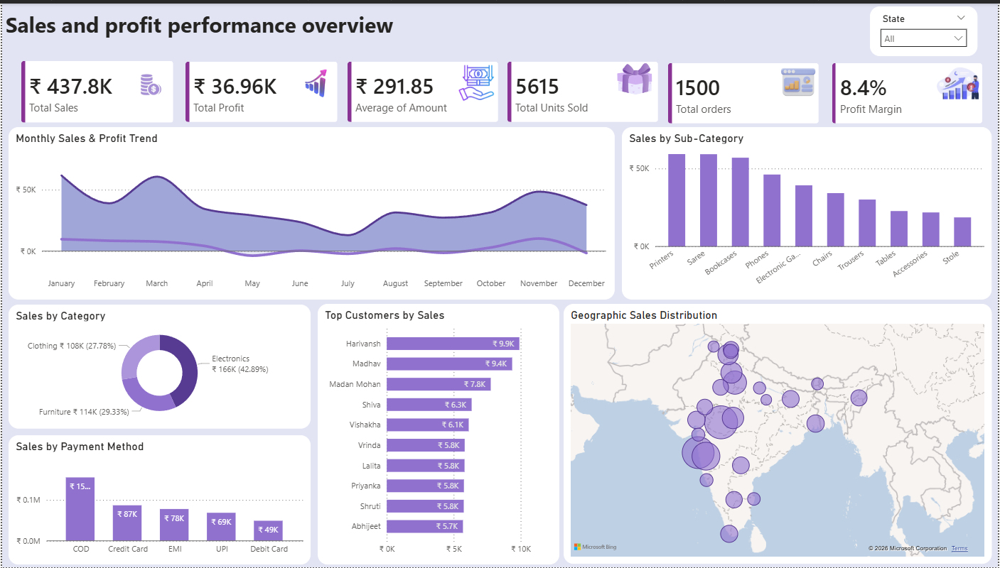

# 📊 Sales & Profit Performance Dashboard (Power BI)

## 📌 Project Overview
This project presents an interactive Power BI dashboard that analyzes sales and profit performance across different dimensions such as time, category, customers, and geography.

The goal of this project is to transform raw data into meaningful insights for business decision-making.

---

## 🚀 Key Insights
- Total Sales: ₹437K+
- Total Profit: ₹36K+
- Profit Margin: 8.4%
- Total Orders: 1500+
- Strong performance in Electronics category
- Top customers contributing major revenue
- Regional sales concentration visualized on map

---

## 📊 Dashboard Features
- 📈 Monthly Sales & Profit Trend
- 🛍️ Sales by Category & Sub-Category
- 👥 Top Customers Analysis
- 🌍 Geographic Sales Distribution (Map)
- 💳 Sales by Payment Method
- 📦 Units Sold & Order Tracking

---

## 🧮 Key Metrics (KPIs)
- Total Sales
- Total Profit
- Average Order Value
- Total Orders
- Total Units Sold
- Profit Margin %

---

## 🛠 Tools & Technologies Used
- Power BI
- Data Modeling
- DAX (Data Analysis Expressions)
- Data Cleaning & Transformation

---

## 📂 Dataset
- Source: Kaggle (Sample Sales Dataset)
- Contains: Orders, Customers, Categories, Sales, Profit, Location

---

## 🎯 Business Use Case
This dashboard helps businesses:
- Track performance over time
- Identify top-performing products and customers
- Understand regional demand
- Improve profit margins

## 📸 Dashboard Preview

